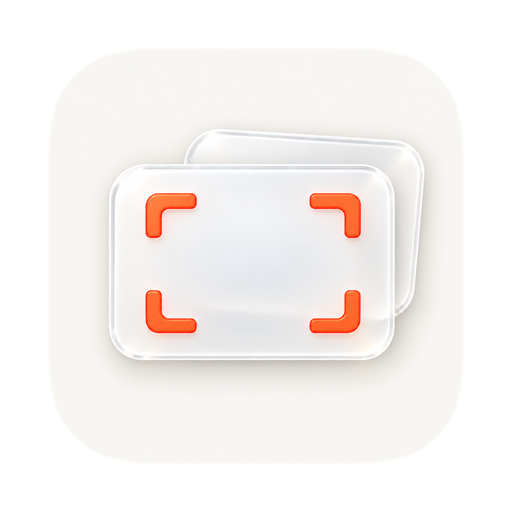
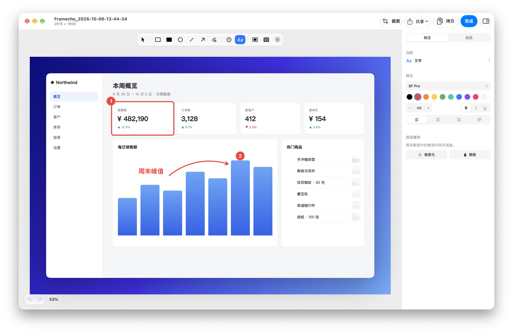
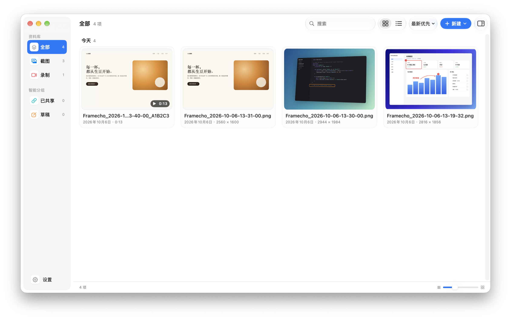
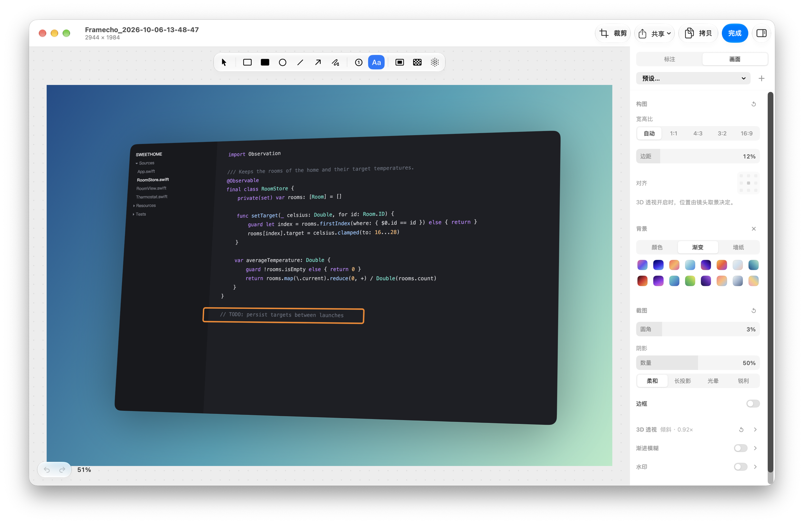
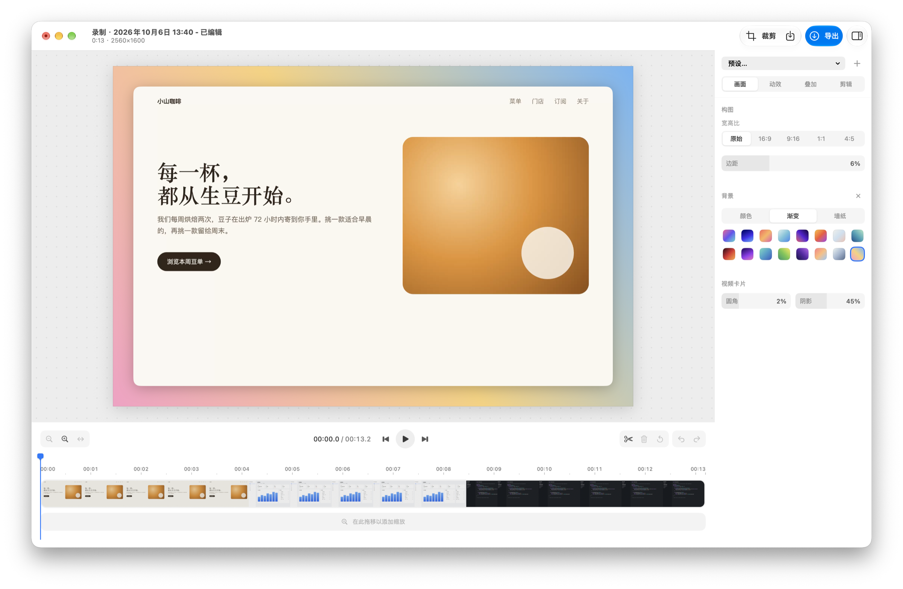

<div align="center">



# Framecho

原生 macOS 截图、录屏与编辑工具

本地素材库 · 非破坏性编辑 · 简体中文界面 · 部署在自己 Cloudflare 账号上的云端分享

[](https://github.com/helson-lin/Framecho/releases/latest)
[](https://github.com/helson-lin/Framecho/actions/workflows/ci.yml)

[](LICENSE)

**[下载 Framecho.dmg](https://github.com/helson-lin/Framecho/releases/latest/download/Framecho.dmg)** · [发布记录](https://github.com/helson-lin/Framecho/releases) · [反馈问题](https://github.com/helson-lin/Framecho/issues)



</div>

---

- **系统要求**：macOS 26.4 或更高版本；发布包同时支持 Apple Silicon 和 Intel。
- **项目来源**：基于 [Screendrop](https://github.com/fayazara/Screendrop) 开发，现由 [helson-lin](https://github.com/helson-lin) 完全独立维护，不再同步上游；使用自己的应用标识、签名、公证、发布渠道和 Sparkle 更新源。GitHub 仓库已由 `helson-lin/Screendrop` 更名为 `helson-lin/Framecho`，旧地址会自动跳转。

> [!NOTE]
> 项目仍在持续开发中。反馈问题时，请附上 macOS 版本、Framecho 版本和复现步骤。

**目录**：[安装与更新](#安装与更新) · [功能](#功能) · [相比 Screendrop](#相比-screendrop-的改进) · [快捷键](#默认快捷键) · [隐私与权限](#隐私与权限) · [壁纸资源包](#壁纸资源包) · [云端分享](#云端分享) · [开发](#开发) · [致谢与许可](#致谢与许可)

## 安装与更新

1. 下载最新的 [`Framecho.dmg`](https://github.com/helson-lin/Framecho/releases/latest/download/Framecho.dmg)。
2. 打开 DMG，将 **Framecho** 拖入「应用程序」文件夹。
3. 启动 Framecho，按提示授予屏幕录制权限。

正常启动会打开素材库，菜单栏提供截图和录屏入口；登录时启动只留在菜单栏。正式发布包使用 Developer ID 签名并经过 Apple 公证。

**自动更新**：Framecho 通过 Sparkle 检查更新，更新源为本仓库 `main` 分支上的 [`appcast.xml`](https://raw.githubusercontent.com/helson-lin/Framecho/main/appcast.xml)，DMG 保存在 GitHub Release 附件中。已是最新版时不会提示；Debug 构建不检查更新。

**从旧版本升级**：早期版本保存的 `.screendrop` 编辑记录、`.screendroprec` 录屏项目会在启动时自动改名为 `.framecho`、`.framechorec`，素材库和编辑记录不受影响。

### 数据位置与卸载

| 位置 | 内容 |
| --- | --- |
| `~/Library/Application Support/Framecho/` | 素材库：截图（`History/`）、录屏项目（`Recordings/`）、壁纸（`Wallpapers/`）和 `history.json` |
| `~/Pictures/Framecho/` | 默认导出目录，可在设置中修改 |
| 钥匙串中的 `com.jarinhe.Framecho` | 云端分享的上传令牌 |

备份时复制 `Application Support/Framecho` 整个文件夹即可。卸载时退出 Framecho、删除应用，再按需删除上面的文件夹和钥匙串项目；设置保存在 `~/Library/Preferences/com.jarinhe.Framecho.plist`。

## 功能

### 截图

- 全屏、窗口和区域截图；区域选择时按空格切换到窗口截图。
- 定时截图、窗口阴影、PNG / JPEG 导出及自定义保存目录。
- 本地 OCR：框选屏幕区域即可识别并复制文字，无需保存截图。
- 浮动预览卡片可调整大小、位置和操作顺序，提供复制、保存、压缩、编辑、上传、置顶和删除。
- 截图可置顶在屏幕上：框选区域后直接置顶，或置顶最近一张截图；置顶窗口可用滚轮调整透明度。

### 素材库

- 统一管理截图、视频和可编辑录屏项目，支持搜索、排序、网格 / 列表视图与批量操作。
- 从 Finder 打开图片时导入副本进行编辑，原文件保持不变。



### 图片编辑器

- **标注**：矩形、圆形、箭头、直线、自由绘制、文字、编号和高亮；工具在画布顶部的悬浮工具条中，每个工具都有单键快捷键。
- **完成与拷贝**：「完成」存储并关闭；「拷贝」直接拷贝当前画面，未存储的修改也会包含在内；存储、存储为和上传在「共享」菜单中。
- **遮挡**：模糊、像素化，以及自动识别并遮挡敏感文字。
- **非破坏性**：裁剪、撤销与重做；保留原图和 `.framecho` 编辑 sidecar，可随时再次修改。
- **背景**：纯色、渐变、自定义壁纸和按需下载的壁纸包，配合留白、圆角、阴影、边框、水印和画布比例。
- **效果**：3D 透视（镜头角度、取景、卡片旋转）和渐进模糊。
- **预设**：导入、导出 `.framechopreset` 背景预设（仍可导入旧版 `.screendroppreset`）；本地壁纸文件不随预设导出。

侧边栏按作用范围分为两个标签。选择工具或选中标注时，会自动切回「标注」。



| 标签 | 内容 |
| --- | --- |
| 标注 | 工具、样式、自动遮挡 |
| 画面 | 预设、构图、背景、截图外观（圆角、阴影、边框）、3D 透视、渐进模糊、水印 |

### 录屏

- 录制显示器、窗口或区域，可同时录制摄像头、麦克风和系统音频。
- 暂停、继续、重新录制；屏幕和摄像头轨道分别保存。
- 提词器，可通过设备端语音识别跟随讲述进度。

### Studio 视频编辑

- **剪辑**：时间线分割、裁剪、删除片段和调整播放速度。
- **镜头**：自动 / 手动缩放、鼠标跟随、重建光标、点按效果和按键字幕。
- **3D 运镜**：为视频卡片设置基础姿态，并在时间线上添加带进入 / 退出过渡的姿态变化；可在画布上用旋转球直接调整，在运镜轨道上拖出一段即可添加，导出时带运动模糊。
- **摄像头**：调整位置、大小和圆角；保存背景与布局预设。
- **字幕**：设备端转写、字幕编辑、逐词高亮，以及通过编辑文字剪辑视频。
- **导出**：原始比例、横屏、竖屏和方形画幅，支持单独裁剪画面；可设置质量、编码、分辨率、30 / 60 fps、运动模糊和音频。导出与分享使用项目的编辑结果，支持进度显示和取消。

侧边栏按设置类型分为四个标签。在时间线上选中缩放、运镜或片段时，会自动切到对应标签。



| 标签 | 内容 |
| --- | --- |
| 画面 | 构图、背景、视频卡片 |
| 动效 | 缩放、3D 运镜 |
| 叠加 | 光标、按键、字幕、摄像头 |
| 剪辑 | 所选片段、按文字剪辑、音频 |

两个编辑器中的数值框都可以直接拖动或点击定位，填充条显示当前值在范围中的位置。按住 <kbd>Option</kbd> 拖动可微调，<kbd>Shift</kbd> + 方向键按 10% 步进，点击数值可直接输入。

### 分享与自动化

- 使用自己的 Cloudflare Workers、R2 和 D1 分享截图与视频。
- 视频分享页支持播放器、拖动预览、可搜索的转写文本和评论。
- 截图与录屏分别配置自动保存、复制、上传和打开编辑器等动作；上传与上传后复制链接可分别设置。
- 支持快捷指令、Siri 和 App Intents。

## 相比 Screendrop 的改进

Framecho 以 [Screendrop](https://github.com/fayazara/Screendrop) v0.34.0（2026 年 10 月 1 日）为基础，并合入了此后的几个上游 PR。下面只列出 Framecho 独立维护后新增或改动的部分，上游已有的功能（Metal 运动模糊、30 / 60 fps 导出、置顶、OCR、智能遮挡等）不在其列。

**中文支持**
- 完整的简体中文界面，所有界面文字都通过 String Catalog 本地化。
- OCR 和自动遮挡可以识别中文：按图片检测语言，能读出英文为主的行里夹杂的中日韩文字，大截图分块识别，复制出的文字保持原有排版。

**编辑器**
- 视频 3D 运镜：在时间线上为视频卡片添加带过渡的姿态变化，可以在画布上用旋转球调整，导出时带运动模糊。
- 图片编辑器的工具移到画布上方的悬浮工具条，每个工具都有单键快捷键；顶栏改为「完成」和「拷贝」，并加入撤销 / 重做按钮。
- 两个编辑器的侧边栏按用途分成标签页（图片：标注 / 画面；Studio：画面 / 动效 / 叠加 / 剪辑），选中对象时自动切换；数值框改为可拖动、可点击定位的滑块。

**置顶截图**
- 新增「区域截图并置顶」和「置顶最近一张截图」快捷键。
- 可以直接在置顶窗口里选择、移动和标注；支持按键、触控板捏合和 <kbd>⌘</kbd> + 滚轮缩放，显示并可调整透明度；支持实况文本。

**录屏**
- 录屏选择器和录制过程中显示麦克风实时电平；再次按录屏快捷键即可停止录制；放弃或重新录制前会再次确认。
- 屏幕改为以 4:2:0 采集（原为 BGRA，每像素数据量从 4 字节降到 1.5 字节），摄像头以 720p 4:2:0 录制；光标图像未变化时不再重复编码。

**素材库、设置与首次使用**
- 素材库重新设计：侧边栏加入智能分组，按日期分组显示，网格缩略图大小可调，列表视图可按列排序。
- 设置窗口按类别分组，快捷键有单独的设置页；菜单栏菜单显示截图快捷键。
- 新增首次使用引导，实时显示各项权限的状态；截图缺少屏幕录制权限时会自动打开引导。

**性能与可靠性**
- 拷贝到剪贴板、生成预览缩略图、有损自动保存等耗时操作移出主线程；新截图直接移入历史记录而不是复制；云端上传直接从磁盘流式读取。
- 编辑、裁剪和压缩后的图片保留原始 DPI。
- `history.json` 部分损坏时，仍保留可读的记录，并备份无法读取的部分。
- 修复 Intel Mac 上的视频导出渲染。

**分享**
- 截图以 AVIF 格式上传，同时附带 JPEG 预览图。
- 配套 Worker 由本项目维护：[Framecho-worker](https://github.com/helson-lin/Framecho-worker)。

**工程**
- 使用独立的签名、公证和 Sparkle 更新源。
- 新增 CI 和一组独立检查脚本，发布工具在检查或 CI 未通过时拒绝发布。

## 默认快捷键

| 快捷键 | 操作 |
| --- | --- |
| <kbd>⌥</kbd> <kbd>1</kbd> | 全屏截图 |
| <kbd>⌥</kbd> <kbd>2</kbd> | 窗口截图 |
| <kbd>⌥</kbd> <kbd>3</kbd> | 区域截图 |
| <kbd>⌥</kbd> <kbd>4</kbd> | 打开录屏选择器 |
| <kbd>⌥</kbd> <kbd>5</kbd> | 识别并复制屏幕文字 |
| <kbd>⌥</kbd> <kbd>6</kbd> | 倒计时后截图 |
| <kbd>⌥</kbd> <kbd>7</kbd> | 区域截图并置顶 |
| <kbd>⌥</kbd> <kbd>8</kbd> | 置顶最近一张截图 |
| <kbd>⌘</kbd> <kbd>⇧</kbd> <kbd>L</kbd> | 打开素材库 |

以上八个全局快捷键都可在设置中修改，素材库快捷键固定。新快捷键无法注册时，应用会保留原先可用的设置并说明原因。

图片编辑器中（编辑文字时除外）：

| 快捷键 | 操作 |
| --- | --- |
| <kbd>H</kbd> 选择 · <kbd>R</kbd> 矩形 · <kbd>⇧</kbd> <kbd>R</kbd> 实心矩形 · <kbd>O</kbd> 圆形 · <kbd>L</kbd> 直线 · <kbd>A</kbd> 箭头 · <kbd>F</kbd> 自由绘制 | 形状与线条 |
| <kbd>N</kbd>（或 <kbd>1</kbd>）编号 · <kbd>T</kbd> 文字 · <kbd>S</kbd> 高亮 · <kbd>P</kbd> 像素化 · <kbd>B</kbd> 模糊 | 编号、文字与遮挡 |
| <kbd>⌘</kbd> <kbd>C</kbd> | 拷贝当前画面 |
| <kbd>⌘</kbd> <kbd>↩</kbd> | 完成（存储并关闭） |
| <kbd>⌘</kbd> <kbd>S</kbd> / <kbd>⇧</kbd> <kbd>⌘</kbd> <kbd>S</kbd> | 存储 / 存储为 |
| <kbd>⇧</kbd> <kbd>⌘</kbd> <kbd>C</kbd> | 裁剪 |
| <kbd>⌘</kbd> <kbd>Z</kbd> / <kbd>⇧</kbd> <kbd>⌘</kbd> <kbd>Z</kbd> | 撤销 / 重做 |
| <kbd>⌘</kbd> <kbd>1</kbd> / <kbd>⌘</kbd> <kbd>0</kbd> | 适合窗口 / 实际大小 |

## 隐私与权限

截图、录屏原始轨道、编辑项目和转写文本都保存在 Mac 本地。语音转写在设备端运行，首次使用时系统可能需要下载语言模型。文件只会在手动上传或已启用自动上传时，发送到你自己配置的服务。

| 权限 | 用途 |
| --- | --- |
| 屏幕与系统音频录制 | 截图、录屏和系统音频 |
| 摄像头 | 摄像头预览及独立视频轨道 |
| 麦克风 | 旁白与提词器语音跟随 |
| 输入监控 | 可编辑的按键字幕 |

摄像头、麦克风和输入监控只在用到相应功能时才请求。截图和录屏默认排除 Framecho 自身窗口；需要录制预览卡片、控制条或设置界面时，可在通用设置中开启「捕获自身窗口」。

## 壁纸资源包

壁纸包在点击安装时下载，保存在 `~/Library/Application Support/Framecho/Wallpapers/`，截图和视频编辑器都可以使用；也可以直接选择自己的图片作为背景。

| 包 ID | 资源包 | 原作者 | 图片数 | 下载地址 |
| --- | --- | --- | --- | --- |
| `uihssn` | UIHSSN | [Ahmed Hassan](https://x.com/uihssn) | 12 | [uihssn-wallpaper-pack.zip](https://r2.jarin.me/Frameecho/uihssn-wallpaper-pack.zip) |
| `fayaz` | Fayazara | [Fayaz Ahmed](https://x.com/fayazara) | 5 | [fayaz-wallpaper-pack.zip](https://r2.jarin.me/Frameecho/fayaz-wallpaper-pack.zip) |

下载失败时，仍可使用已安装的壁纸、纯色、渐变或自定义图片。壁纸来自 Screendrop 的壁纸包，版权归原作者所有，本仓库的 CC0 许可不适用于这些图片。托管细节见 [壁纸包托管](docs/wallpaper-hosting.md)。

## 云端分享

Framecho 不提供公共上传服务器，云端分享需要部署到你自己的 Cloudflare 账号。配套服务由本项目维护：[Framecho-worker](https://github.com/helson-lin/Framecho-worker)，截图和录屏分享使用 Workers + R2 + D1，壁纸下载桶可以独立使用。

1. 打开 **设置 → 云端**，复制生成的上传令牌。
2. 通过设置中的部署入口，将 Worker 部署到自己的 Cloudflare 账号。
3. 将上传令牌配置为 Worker 的 `UPLOAD_TOKEN` secret，并完成 R2 / D1 绑定。
4. 把 Worker URL 填回 Framecho，验证连接后即可上传。

手动部署时，可以用 Wrangler 设置令牌：

```bash
npx wrangler secret put UPLOAD_TOKEN
```

首次部署只需要 `UPLOAD_TOKEN`；用于评论和点赞的 GitHub / Google OAuth 可在部署后选配。上传令牌保存在 macOS 钥匙串中。

## 开发

### 从源码构建

需要 macOS 26.4 或更高版本，以及 Xcode 27.1（发布版与 CI 使用的版本）。Xcode 会自动解析 Sparkle 和 DockProgress 依赖。

```bash
git clone https://github.com/helson-lin/Framecho.git
cd Screendrop

DEVELOPER_DIR=/Applications/Xcode.app/Contents/Developer xcodebuild build \
  -project Framecho.xcodeproj \
  -scheme Framecho \
  -configuration Debug \
  -destination "platform=macOS"
```

> [!TIP]
> - Studio 的运动模糊使用 Metal 着色器。构建提示缺少 Metal Toolchain 时，先运行 `xcodebuild -downloadComponent MetalToolchain`。
> - 签名配置使用维护者的 Apple 开发者团队。请在 Xcode 中换成自己的团队；只做本地编译验证时，可在命令后加 `CODE_SIGNING_ALLOWED=NO`，这样的产物不用于分发。

工程为 `Framecho.xcodeproj`，生成的应用为 `Framecho.app`，Bundle ID 为 `com.jarinhe.Framecho`。共享 scheme 有三个：`Framecho`；`Framecho Dev`，构建独立的 `Framecho Dev.app`（Bundle ID `com.jarinhe.Framecho.dev`），可与正式版并存；`Framecho Demo`，以 `--demo-mode` 启动。

### 自动检查

项目没有 Xcode 测试 target。`scripts/` 中的独立检查会直接编译相关的生产代码并运行，不需要启动应用：

```bash
scripts/run-checks.sh
```

发布工具的测试：

```bash
go test ./cmd/...
```

新增的 `scripts/check-*.swift` 必须在 `run-checks.sh` 中运行，或列入其中的 `not_run`，否则脚本会报错。需要被检查的逻辑应放在不依赖应用即可编译的文件里。

性能专项检查见 [视频导出性能](docs/export-performance.md) 和 [编辑器性能](docs/editor-performance.md)。

每个 Pull Request 和推送到 `main` 的提交都会运行 [GitHub Actions](.github/workflows/ci.yml)；只改动 `appcast.xml`、文档或 Markdown 的推送会跳过。

| 检查 | 内容 |
| --- | --- |
| Build app | 在 GitHub `xcode-27` 镜像上用 Xcode 27.1 做不签名的 Debug 构建 |
| Standalone checks | 运行 `scripts/run-checks.sh` |
| Release tool | 在 Linux 上对发布工具运行 `go vet` 和 `go test` |

`xcode-27` 镜像目前仍是 beta，GitHub 调整其中的 Xcode 版本时，需要同步更新工作流。

发布流程见 [docs/releasing.md](docs/releasing.md)。

## 致谢与许可

感谢 [Screendrop](https://github.com/fayazara/Screendrop) 及其贡献者提供项目基础。Framecho 的发布与维护在本仓库进行，问题请提交到 [Framecho Issues](https://github.com/helson-lin/Framecho/issues)。

本仓库沿用 [CC0 1.0 Universal](LICENSE)。外部壁纸、第三方依赖和云端 Worker 的许可请分别查看各自来源，本仓库的许可不自动适用于它们。
